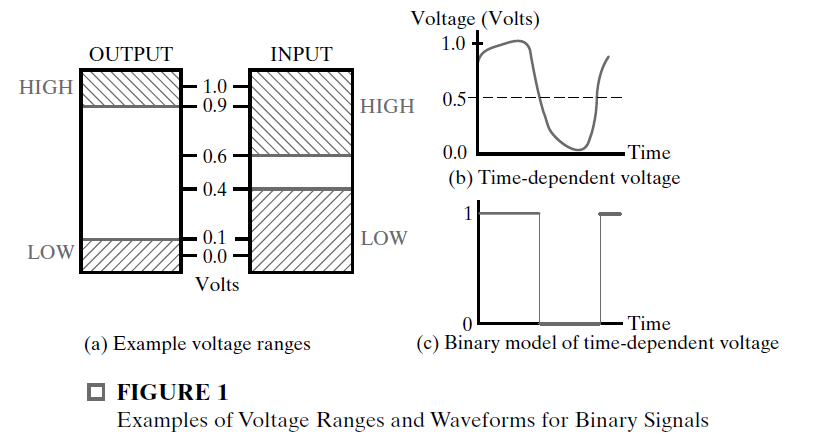
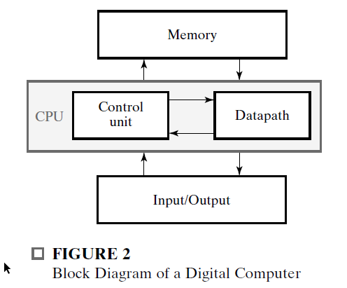

# Digital Systems And Information

* Today, the term “digital circuits” is viewed as synonymous
  with the term “logic circuits.”
  
* The general-purpose digital computer is a digital system that can follow a stored
  sequence of instructions, called a program, that operates on data.
  
  ## Information Representation
  
  Digital systems store, move, and process information.
  
  In general, information systems must be able to represent both continuous and discrete information.
  
  The signals in most present-day electronic digital systems
  use just two discrete values and are therefore said to be binary. The two discrete
  values used are often called 0 and 1, the digits for the binary number system.
  
* The HIGH output voltage value ranges between 0.9 and 1.1 volts, and the LOW output voltage value between -0.1 and 0.1 volts. The high input range allows 0.6 to 1.1 volts to be recognized as a HIGH, and the low input range allows -0.1 to 0.4 volts to be recognized as a LOW. The fact that the input ranges are wider than the output ranges allows the circuits to function correctly in spite of variations in their behavior and undesirable “**noise**” voltages that may be added to or subtracted from the outputs.
  
  
  
* We give the output and input voltage ranges a number of different names. 
  * HIGH (H) and LOW (L)
  * TRUE (T) and FALSE (F)
  * 1 and 0.
  
* Unless otherwise indicated,
  we assume that TRUE and 1 are associated with the higher of the voltage
  ranges, H, and that FALSE and 0 are associated with the lower of the voltage
  ranges, L. This particular convention is called **positive logic**.  

* By using various coding techniques,
  groups of bits can be made to represent not only binary numbers, but also other
  groups of discrete symbols. Groups of bits, properly arranged, can even specify to
  the computer the program instructions to be executed and the data to be processed.
  
* Why is binary used ?
    * consider a system with 10 values representing the decimal digits
        * This would
          require complex and costly electronic circuits, and the output still could be disturbed by small “noise” voltages or small variations in the circuits occurring during
          their manufacture or use.
        * As a consequence, the use of such multivalued circuits is
          very limited.  
    * Use of binary values makes the results calculated repeatable in the sense that the
      same set of input values to a calculation always gives exactly the same set of outputs.  
    * This is not necessarily the case for multivalued or analog circuits, in which
      **noise voltages** and **small variations** **due to manufacture** or circuit aging can cause
      results to differ at different times.  

## The Digital Computer
        
        