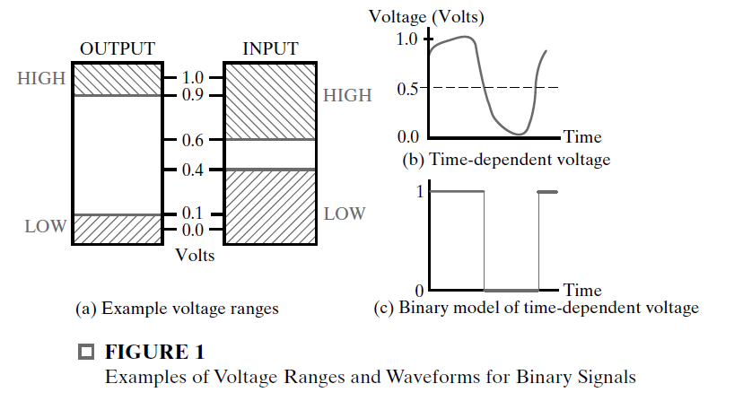
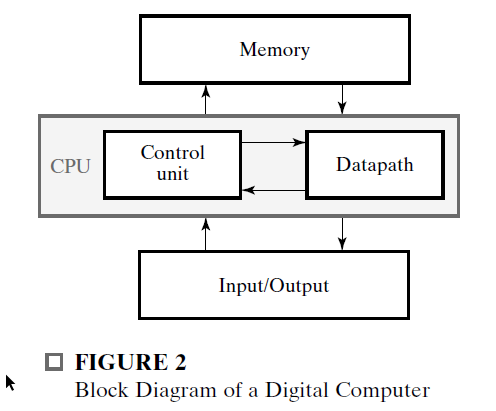
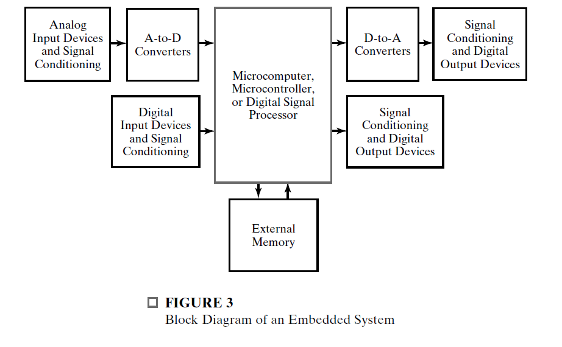
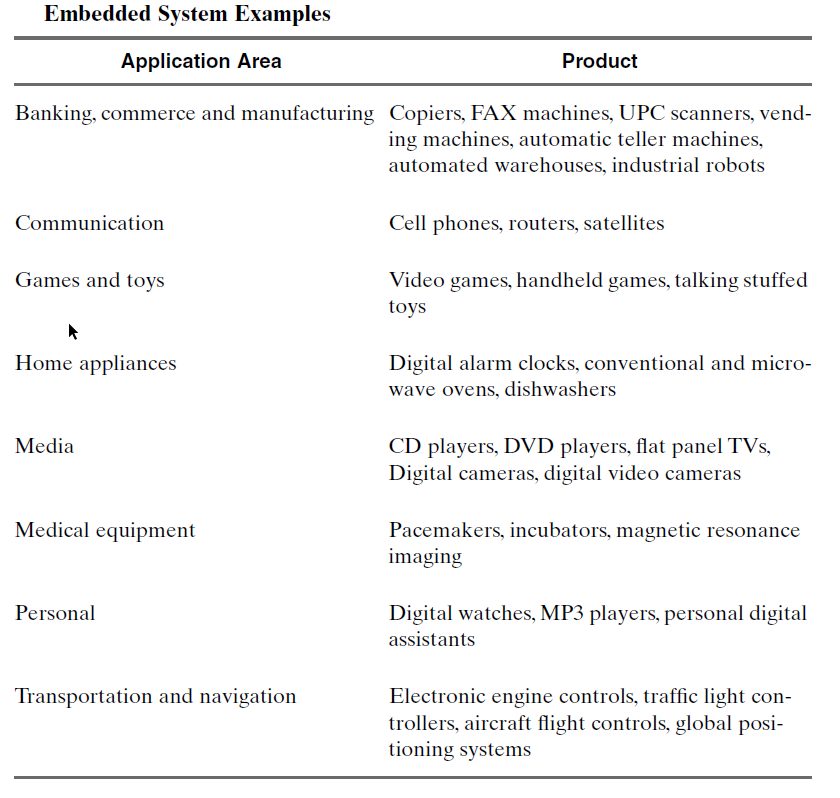
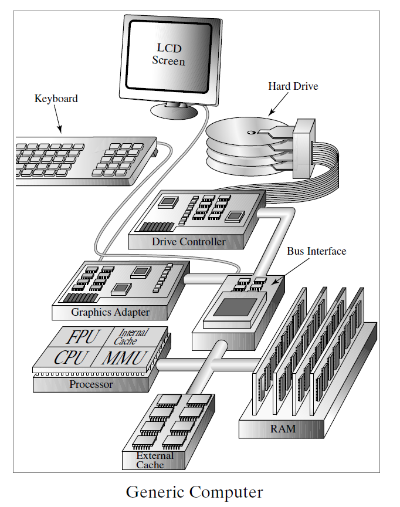

# Digital Systems And Information

* Today, the term “digital circuits” is viewed as synonymous
  with the term “logic circuits.”
  
* The general-purpose digital computer is a digital system that can follow a stored
  sequence of instructions, called a program, that operates on data.
  
  ## Information Representation
  
  Digital systems store, move, and process information.
  
  In general, information systems must be able to represent both continuous and discrete information.
  
  The signals in most present-day electronic digital systems
  use just two discrete values and are therefore said to be binary. The two discrete
  values used are often called 0 and 1, the digits for the binary number system.
  
* The HIGH output voltage value ranges between 0.9 and 1.1 volts, and the LOW output voltage value between -0.1 and 0.1 volts. The high input range allows 0.6 to 1.1 volts to be recognized as a HIGH, and the low input range allows -0.1 to 0.4 volts to be recognized as a LOW. The fact that the input ranges are wider than the output ranges allows the circuits to function correctly in spite of variations in their behavior and undesirable “**noise**” voltages that may be added to or subtracted from the outputs.
  
  
  
* We give the output and input voltage ranges a number of different names. 
  * HIGH (H) and LOW (L)
  * TRUE (T) and FALSE (F)
  * 1 and 0.
  
* Unless otherwise indicated,
  we assume that TRUE and 1 are associated with the higher of the voltage
  ranges, H, and that FALSE and 0 are associated with the lower of the voltage
  ranges, L. This particular convention is called **positive logic**.  

* By using various coding techniques,
  groups of bits can be made to represent not only binary numbers, but also other
  groups of discrete symbols. Groups of bits, properly arranged, can even specify to
  the computer the program instructions to be executed and the data to be processed.
  
* Why is binary used ?
    * consider a system with 10 values representing the decimal digits
        * This would
          require complex and costly electronic circuits, and the output still could be disturbed by small “noise” voltages or small variations in the circuits occurring during
          their manufacture or use.
        * As a consequence, the use of such multivalued circuits is
          very limited.  
    * Use of binary values makes the results calculated repeatable in the sense that the
      same set of input values to a calculation always gives exactly the same set of outputs.  
    * This is not necessarily the case for multivalued or analog circuits, in which
      **noise voltages** and **small variations** **due to manufacture** or circuit aging can cause
      results to differ at different times.  

## The Digital Computer
        
        

The memory stores programs as well as input, output, and intermediate data.

The datapath performs arithmetic and other data-processing operations as specified by the program.

The control unit supervises the flow of information between the various units.

A datapath, when combined with the control unit, forms a component referred to as a
central processing unit, or CPU.

The control unit in the CPU retrieves the instructions, one by one, from the
program stored in the memory. For each instruction, the control unit manipulates
the datapath to execute the operation specified by the instruction.

## Beyond the Computer

In terms of world impact, computers, such as the PC, are not the end of the story.
Smaller, often less powerful, single-chip computers called microcomputers or
microcontrollers, or special-purpose computers called digital signal processors
(DSPs) actually are more prevalent in our lives.

As a consequence of
being integral parts of other products and often enclosed within them, they are
called **embedded systems**.

* microcomputer(or its equivalent), has many of the characteristics of the PC, but differs in the sense that its software programs are often permanently stored to provide only the functions required for the product.
    * This software, which is critical to the operation of the
      product, is an integral part of the embedded system and referred to as **embedded
      software**.
    * The microcomputer contains some memory; if additional memory is needed, it can be added externally.  
    * The input and output devices are of two types, those which use analog signals and those which use digital signals.
* Discrepancy between the actual data and the digital data is called the **quantization error**.    

## More on the Generic Computer

Modern processors such as this one are quite complex and consist of tens to hundreds of millions of transistors.
* The processor contains four functional modules: the CPU, the FPU, the MMU, and the internal cache.

    * The **FPU (floating-point unit)** is somewhat like the CPU, except that its datapath and control unit are specifically designed to perform floating-point operations.
    
    * The CPU and the FPU, in relation to Figure 2, each contain a datapath and a
      control unit.
      
    * The **MMU is the memory management unit**. The MMU plus the internal cache
      and the separate blocks near the bottom of the computer labeled “External Cache”
      and “RAM” (random-access memory) are all part of the memory in figure 2.
     
        
         
    * The two caches are special kinds of memory that allow the CPU and FPU to get at the
      data to be processed much faster than with RAM alone.  
    
    * RAM is what is most commonly referred to as memory.
* The connection paths shown between the processor, memory, and external
  cache are the pathways between integrated circuits.
    * These are typically implemented as fine copper conductors on a printed circuit board.
    * The connection paths below the bus interface are referred to as the processor bus.
    * The connections above the bus interface are the input/output (I/O) bus.
    * The processor bus and the I/O bus attached to the bus interface carry data having different numbers of bits and have different ways of controlling the movement of data.  
        * They may also operate at different speeds.
        * The bus interface hardware handles these differences so that data can be communicated between the two buses.  
* The hard drive, is an electromechanical magnetic storage device.        
    * It stores large quantities of information in the form of magnetic flux on spinning disks coated with magnetic materials.    
    * In order to control the hard drive and transfer information to and from it, a drive controller is used.  

* The keyboard, graphics adapter card, and drive controller card are all attached to the I/O bus. This allows these devices to communicate through the bus interface with the CPU and other circuitry connected to the processor buses.
      