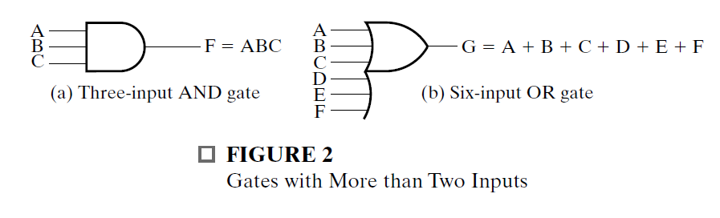

# Combinational Logic Circuits
[Boolean Logic & Logic Gates: Crash Course Computer Science](https://www.youtube.com/watch?v=gI-qXk7XojA&index=5&list=PL8dPuuaLjXtNlUrzyH5r6jN9ulIgZBpdo&t=0s)

## Binary Logic And Gates

Digital circuits are hardware components that manipulate binary information. The circuits are implemented using transistors and interconnections in complex semiconductor devices called **integrated circuits**.

Each basic circuit is referred to as a **logic gate**.For simplicity in design, we model the transistor-based electronic circuits as logic gates.

Each gate performs a specific logical operation. The outputs of gates are applied to the inputs of other gates to form a digital circuit.

Binary logic system is one of a class of mathematical systems generally called **Boolean algebras**

### Binary Logic

Binary logic deals with binary variables, which take on two discrete values, and with the operations of mathematical logic applied to these variables.

Note: In this document, variables are designated by letters of the alphabet, such as A, B, C, X, Y, and Z. Later this notation is expanded to include strings of letters, numbers, and special characters.

* AND 
    * This operation is represented by a dot or by the absence of an operator.
    * For example, Z = X · Y or Z = XY is read “Z is equal to X AND Y.”
    * The logical operation AND is interpreted to mean that Z = 1 if and only if X = 1 and Y = 1; otherwise Z = 0.

* OR
    * This operation is represented by a plus symbol. 
    * For example, Z = X + Y is read “Z is equal to X OR Y,”
    * Meaning of the example is that Z = 1 if X = 1 or if Y = 1, or if both X = 1 and Y = 1. Z = 0 if and only if X = 0 and Y = 0.
* NOT
    * This operation is represented by a bar over the variable.
    * For example, Z =  is read “Z is equal to NOT X,” meaning that Z is what X is not.
    * In other words, if X  1, then Z  0; but if X  0, then Z  1.    
    * The NOT operation is also referred to as the complement operation, since it changes a 1 to 0 and a 0 to 1.

Binary logic resembles binary arithmetic, and the operations AND and OR
have similarities to multiplication and addition, respectively.
* This is why the symbols used for AND and OR are the same as those used for multiplication and addition.

* However, binary logic should not be confused with binary arithmetic.
    * One should realize that an arithmetic variable designates a number that may consist of many digits, whereas a logic variable is always either a 1 or a 0.
    * In binary logic, we have 1 + 1 = 1 (read “one OR one is equal to one”)
    * but in binary arithmetic, we have 1 + 1 = 10 (read “one plus one is equal to two”)
    * To avoid ambiguity, "v" symbol is sometimes used for the OR operation instead of the + symbol.
    * But as long as arithmetic and logic operations are not mixed, each can use the + symbol with its own independent meaning.

A truth table for an operation is a table of combinations of the binary variables showing the relationship between the values that the variables take on and the values of the result of the operation.

### Logic Gates

Logic gates are electronic circuits that operate on one or more input signals to produce an output signal.   

The input terminals of logic gates accept binary signals within the
allowable range and respond at the output terminals with binary signals that fall within a specified range. 

The intermediate regions between the allowed ranges in the figure are crossed only during changes from 1 to 0 or from 0 to 1. These changes are called **transitions**, and the intermediate regions are called the **transition regions**.

* The NOT gate is more commonly referred to as an inverter.
  The reason for this name is apparent from the response in the timing diagram. The output logic signal is an inverted version of input logic signal X.

* In addition to its function, each gate has another very important property called **gate delay**, the length of time it takes for an input change to result in the corresponding output change.
    * Depending on the technology used to implement the gate, the length of time may depend on which of the inputs are changing.
    * In the simplified model introduced here, these variations are ignored and the gate delay is assumed to have a single value, tG.
     * This value may be different for each gate type, number of inputs, and the underlying technology and circuit design of the gate. 

* AND and OR gates may have more than two inputs.

* An AND gate with three inputs and an OR gate with six inputs are shown.
    * The three input AND gate responds with a logic-1 output if all three inputs are logic 1.The output is logic 0 if any input is logic 0.
    * The six-input OR gate responds with a logic 1 if any input is logic 1; its output becomes a logic 0 only when all inputs are logic 0.
    

### Boolean Algebra

The Boolean algebra we present is an algebra dealing with variables and logic operations.

The variables are designated by letters of the alphabet, and the three basic logic operations are AND, OR, and NOT (complementation).

* **A Boolean expression** is an algebraic expression formed by using binary variables, the constants 0 and 1, the logic operation symbols, and parentheses.

* **A Boolean function** can be described by a Boolean equation consisting of a binary variable identifying the function followed by an equals sign and a Boolean expression.
    * Optionally, the function identifier is followed by parentheses enclosing a list of the function variables separated by commas.
    * **A single-output Boolean function** is a mapping from each of the possible combinations of values 0 and 1 on the function variables to value 0 or 1.
    * **A multiple-output Boolean function** is a mapping from each of the possible combinations of values 0 and 1 on the function variables to combinations of 0 and 1 on the function outputs.
